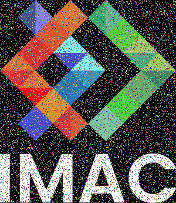
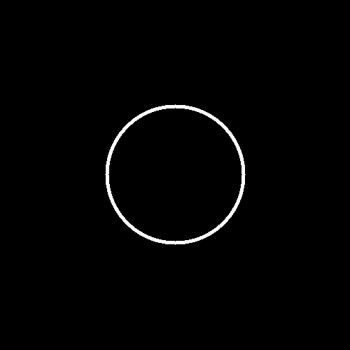
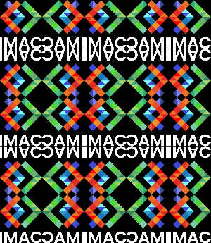

<!DOCTYPE html>
<html>
<body>
  <h1>Ne garder que le vert</h1>
  
&nbsp; &nbsp; &nbsp;&nbsp;

  

  
La fonction vert manipule une image en réduisant les composantes rouge et bleue de chaque pixel à zéro pour créer une version où seule le vert est présent.

  <h1>Échanger les canaux</h1>
  
&nbsp; &nbsp; &nbsp;

  

  
La fonction "canaux" opère sur une image en utilisant une variable temp pour échanger les valeurs des canaux rouge et bleu pour chaque pixel, puis sauvegarde l'image modifiée en format PNG dans un répertoire de sortie spécifié.

  <h1>Noir & Blanc</h1>
  

  
On utilise la moyenne des trois couleurs RGB pour donner une image en noir et blanc.

  <h1>Négatif</h1>
  
&nbsp; &nbsp; &nbsp; &nbsp; &nbsp; &nbsp; &nbsp; &nbsp; &nbsp; &nbsp; &nbsp;

  

  
La fonction “négatif” prend l’inverse de chaque composante r, g, b des couleurs de notre image.

  <h1>Dégradé</h1>
  <h1></h1>
  
On divise nos couleurs par la largeur de l’image.

  <h1>Miroir</h1>
  

  
Il faut s’assurer de copier l’image avant d’appliquer le miroir, pour éviter de manipuler des pixels déjà manipulés en parcourant l’image.

  <h1>Image bruitée</h1>
  

  
On change la couleur d’un pixel sur 7. Pour chaque pixel modifié, on lui génère une couleur aléatoire.

  <h1>Rotation de 90°</h1>
  

  
Après avoir créé une image avec de nouvelles dimensions, on inverse les coordonnées x et y. Pour obtenir une rotation dans le sens des aiguilles d’une montre au lieu de l’inverse, on applique un miroir horizontal sur la coordonnée x.

  <h1>RGB split</h1>
  
&nbsp; &nbsp; &nbsp; &nbsp; &nbsp; &nbsp; &nbsp; &nbsp; &nbsp; &nbsp; &nbsp; &nbsp; 

  
L’image du milieu est un test, l’image de droite est le résultat final. L’effet souhaité est présent mais on a rencontré une petite difficulté : on ne commence qu’au 20 e pixel et on ignore les 20 derniers pixels. Cela est dû au fait qu’on essayait d’accéder à des pixels qui sortent de l’image.

  <h1>Luminosité</h1>
  

  

  
Pour l’assombrissement, on prend le carré de chaque couleur.

  
Pour l’éclaircissement, on prend la racine carrée de chaque couleur.

  <h1>Disque</h1>
  

  
On applique la formule du cercle : ( x − a )^2 + ( y − b )^2 = r^2 avec :

  <ul>
    <li>x et y coordonnées du pixel</li>
    <li>a et b coordonnées du centre du cercle</li>
    <li>r le rayon du cercle.</li>
  </ul>
  <h1>Cercle</h1>
  

  
On ajoute une thickness pour ne colorier qu’une fine partie du disque dessiné auparavant.

  <h1>Rosace</h1>
  

  
On dessine 6 cercles supplémentaires autour du cercle central. Chaque nouveau cercle voit son centre être éloigné d’un rayon du centre du cercle initial, suivi d’un pivot de multiple de 60°. On obtient PI avec arccos(-1).

  <h1>Mosaïque</h1>
  

  
Pendant qu’on parcourt la grande image, on reboucle sur chaque cinquième pour dessiner le logo entièrement, nous laissant avec 4 boucles imbriquées.

  <h1>Mosaïque Miroir</h1>
  

  
On traite chaque cas de figure séparément, selon la ressemblance de comportement :

  
- les petites images dont la ligne et la colonne sont impaires

  
- les lignes impaires dont la colonne est paire

  
- pour les lignes paires : d’abord les colonnes impaires puis les colonnes paires

  <h1>Glitch</h1>
  

  
On prend un pixel de coordonnées et dimensions aléatoires et le positionne à des coordonnées aléatoires. Les valeurs aléatoires ont des valeurs minimales et des valeurs maximales pour obtenir l’effet souhaité.

  <h1>Fractale de Mandelbrot</h1>
  

  
On a séparé partie réelle et partie imaginaire parce que cela nous semblait plus clair. Pour se rapporter à l’intervalle [-2, 2], on a utilisé le produit en croix suivant : (x - a) * (d - c) / (b - a) + c avec x = valeur lue, a = valeur lue min, b = valeur lue max, c = valeur sortie min, d = valeur sortie max.

  <h1>Vortex</h1>
  

  
Le pixel subit une rotation plus conséquente autour du pixel central à mesure qu’il s’éloigne de ce dernier.

  <h1>Tramage</h1>
  

  
On applique la matrice 4x4 de Bayer à nos pixels pour voir si on les transforme en noir ou en blanc.

  <h1>Normalisation de l'histogramme</h1>
  

  
La luminosité d’un pixel est calculée en faisant la moyenne de ses 3 composantes r, g, b. Après avoir trouvé la luminosité la plus faible et la plus forte, on se rapporte à l’intervalle [0, 1] grâce à la formule citée à la fractale de Mandelbrot.

  <h1>Convolutions / Netteté, Contours, etc</h1>
  

  

  
Le flou était relativement complexe à faire puisqu’il fallait savoir pour chaque pixel, comment itérer sur le carré de pixels l’entourant et appliquer les bons calculs. On n’a pas utilisé une matrice puisque toutes ses valeurs sont égales (1/taille^2), mais plutôt un float.

  
Les autres convolutions étaient en revanche beaucoup plus simples puisqu’il s’agit quasiment de la même fonction que pour le flou. Il suffisait d’appliquer une matrice différente pour obtenir un résultat différent.

  <h4>&nbsp;</h4>
</body>
</html>
